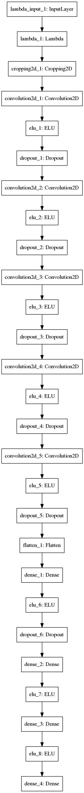
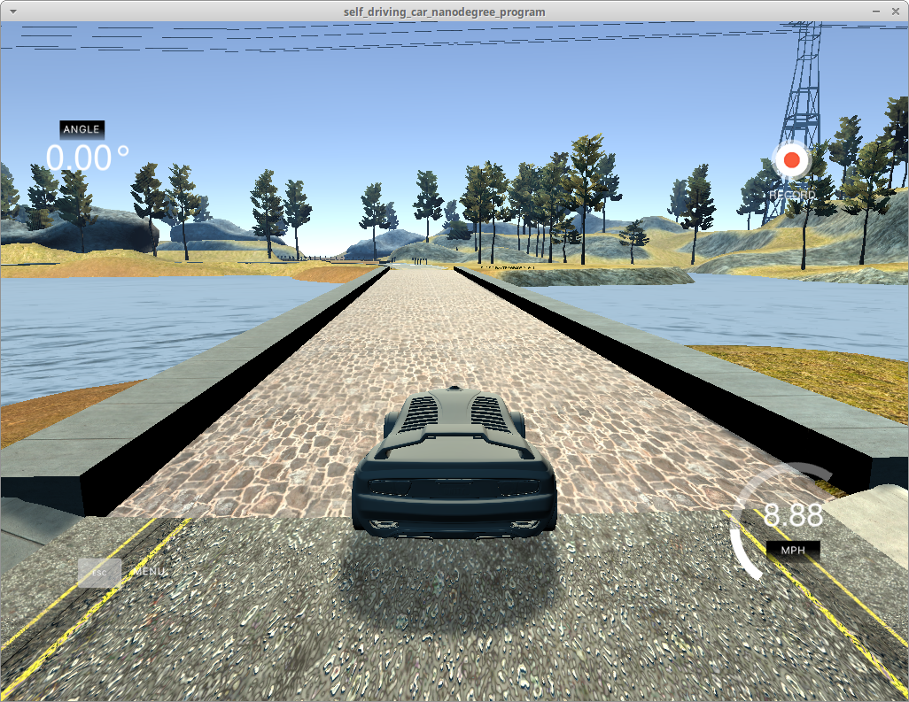
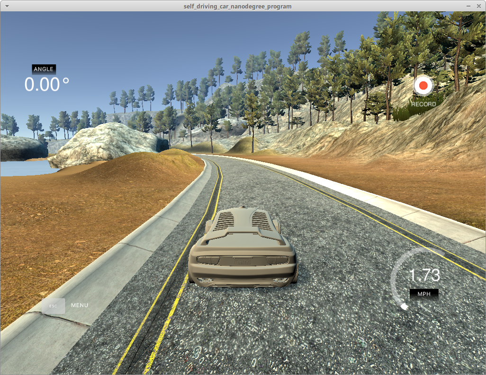
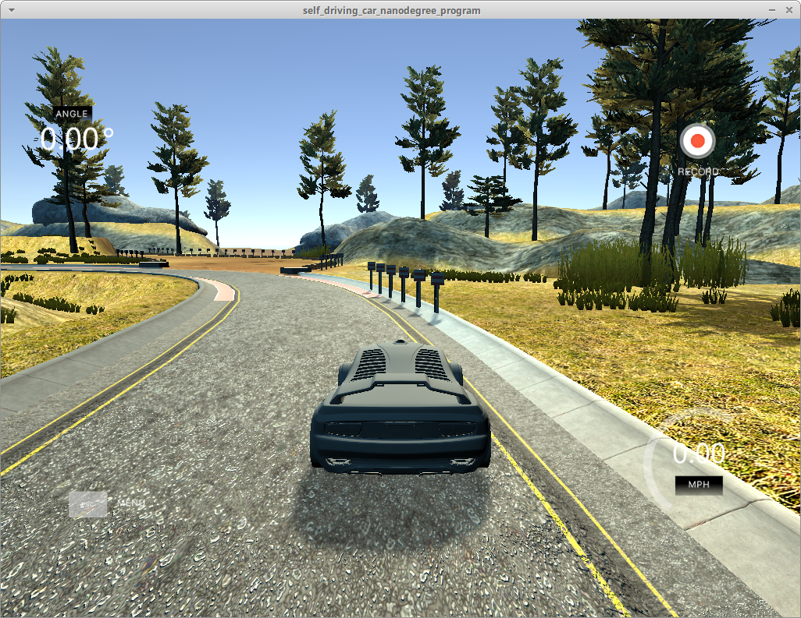
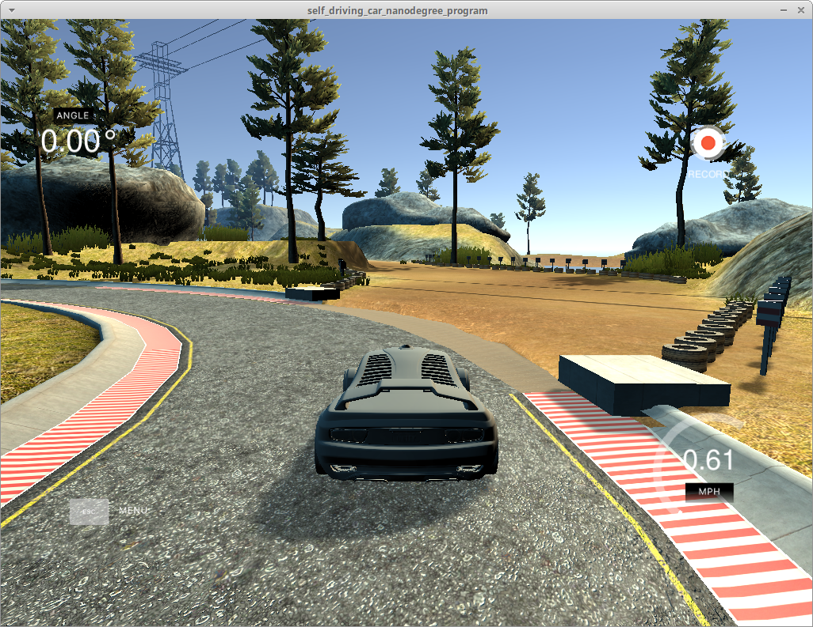
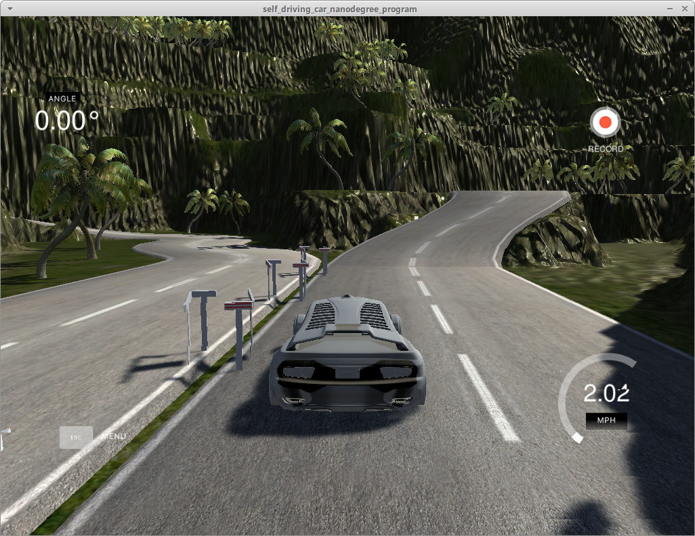
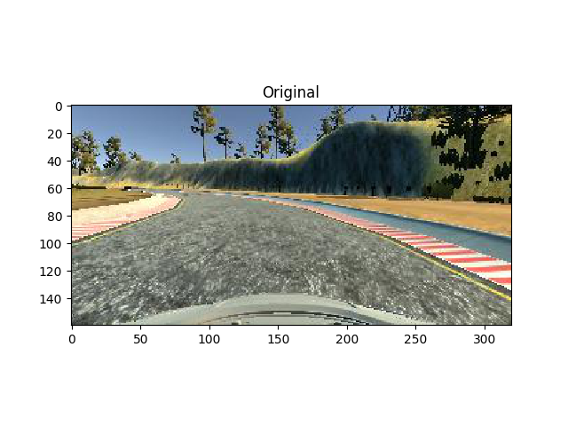
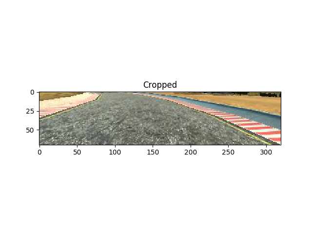

# **Behavioral Cloning**

---

**Behavioral Cloning Project**

The goals / steps of this project are the following:
* Use the simulator to collect data of good driving behavior
* Build, a convolution neural network in Keras that predicts steering angles from images
* Train and validate the model with a training and validation set
* Test that the model successfully drives around track one without leaving the road
* Summarize the results with a written report


[//]: # (Image References)

[model_visualisation]: ./res/model.png "Model Visualization"
[steering_angle_distribution]: ./res/steering_angle_distribution.png "Steering Angle Distribution"

## Rubric Points
### Here I will consider the [rubric points](https://review.udacity.com/#!/rubrics/432/view) individually and describe how I addressed each point in my implementation.

---
### Files Submitted & Code Quality

#### 1. Submission includes all required files and can be used to run the simulator in autonomous mode

My project includes the following files:
* `model.py` containing the script to create and train the model
* `drive.py` for driving the car in autonomous mode
* `model.h5` containing a trained convolution neural network
* `writeup_report.md`summarizing the results
* `video.mp4` for driving the autonomously on track 1
* `video_track2.mp4` for driving the car autonomously on track 2

#### 2. Submission includes functional code
Using the Udacity provided simulator and my drive.py file, the car can be driven autonomously around the track by executing
```sh
python drive.py model.h5
```

#### 3. Submission code is usable and readable

The model.py file contains the code for training and saving the convolution neural network. The file shows the pipeline I used for training and validating the model, and it contains comments to explain how the code works.

### Model Architecture and Training Strategy

#### 1. An appropriate model architecture has been employed

My model is derived from the convolution neural network described in paper **End to End Learning for Self-Driving Cars**[1]. It consists of convolution neural layers with 3x3 or 5x5 filter sizes and depths between 24 and 64 (`model.py` lines 169-181)

The model includes ELU layers to introduce nonlinearity (code line 170-193), and the data is normalized in the model using a Keras lambda layer (code line 167).

#### 2. Attempts to reduce overfitting in the model

The model contains dropout layers in order to reduce overfitting (`model.py` lines 167-189).

The model was trained and validated on different data sets to ensure that the model was not overfitting (code line 97-98). The model was tested by running it through the simulator and ensuring that the vehicle could stay on the track.

#### 3. Model parameter tuning

The model used an adam optimizer, so the learning rate was not tuned manually (`model.py` line 202).

#### 4. Appropriate training data

Training data was chosen to keep the vehicle driving on the road. I used a combination of center lane driving, recovering from the left and right sides of the road, recovering from sharp corners, and driving in the opposite direction. There are 8 laps in total. (`model.py` line 20)

For details about how I created the training data, see the next section.

### Model Architecture and Training Strategy

#### 1. Solution Design Approach

The overall strategy for deriving a model architecture was to iteratively adding features to a simple model.

My first step was to use a convolution neural network model similar to the multi-stage network used to classify German traffic signs [2][3]. I thought this model might be appropriate because it should have enough filters and deep hidden layers for behaviour cloning.

In order to gauge how well the model was working, I split my image and steering angle data into a training and validation set. I also made sure the training set and validation set have similar distribution of steering angle. Otherwise the model may only be validated on straight road. (`model.py` line 88)
![Steering Angle Distribution][steering_angle_distribution]

Then I found that my first model had a low mean squared error on the training set but a high mean squared error on the validation set. This implied that the model was overfitting.

To combat the overfitting, I added dropout layers after convolution layers and the first hidden layer.

Then I adjusted the filter sizes and strides hoping the first stage convolution layers would capture more "global" features.

The final step was to run the simulator to see how well the car was driving around track one. There were a few spots where the vehicle fell off the track, to improve the driving behavior in these cases, I collected more data around sharp coners and sand.

The re-trained model, however, still could not drive through the whole track. So I moved on to the proven **Nvidia** model which has more convolution layers [1].

At adding ELU and dropout layers to **Nvidia** model, the vehicle is able to drive autonomously around the track without leaving the road.

#### 2. Final Model Architecture

The final model architecture (`model.py` lines 165-196) consisted of a convolution neural network with the following layers and layer sizes.

```
____________________________________________________________________________________________________
Layer (type)                     Output Shape          Param #     Connected to                     
====================================================================================================
lambda_1 (Lambda)                (None, 160, 320, 3)   0           lambda_input_1[0][0]             
____________________________________________________________________________________________________
cropping2d_1 (Cropping2D)        (None, 70, 320, 3)    0           lambda_1[0][0]                   
____________________________________________________________________________________________________
convolution2d_1 (Convolution2D)  (None, 33, 158, 24)   1824        cropping2d_1[0][0]               
____________________________________________________________________________________________________
elu_1 (ELU)                      (None, 33, 158, 24)   0           convolution2d_1[0][0]            
____________________________________________________________________________________________________
dropout_1 (Dropout)              (None, 33, 158, 24)   0           elu_1[0][0]                      
____________________________________________________________________________________________________
convolution2d_2 (Convolution2D)  (None, 15, 77, 36)    21636       dropout_1[0][0]                  
____________________________________________________________________________________________________
elu_2 (ELU)                      (None, 15, 77, 36)    0           convolution2d_2[0][0]            
____________________________________________________________________________________________________
dropout_2 (Dropout)              (None, 15, 77, 36)    0           elu_2[0][0]                      
____________________________________________________________________________________________________
convolution2d_3 (Convolution2D)  (None, 6, 37, 48)     43248       dropout_2[0][0]                  
____________________________________________________________________________________________________
elu_3 (ELU)                      (None, 6, 37, 48)     0           convolution2d_3[0][0]            
____________________________________________________________________________________________________
dropout_3 (Dropout)              (None, 6, 37, 48)     0           elu_3[0][0]                      
____________________________________________________________________________________________________
convolution2d_4 (Convolution2D)  (None, 4, 35, 64)     27712       dropout_3[0][0]                  
____________________________________________________________________________________________________
elu_4 (ELU)                      (None, 4, 35, 64)     0           convolution2d_4[0][0]            
____________________________________________________________________________________________________
dropout_4 (Dropout)              (None, 4, 35, 64)     0           elu_4[0][0]                      
____________________________________________________________________________________________________
convolution2d_5 (Convolution2D)  (None, 2, 33, 64)     36928       dropout_4[0][0]                  
____________________________________________________________________________________________________
elu_5 (ELU)                      (None, 2, 33, 64)     0           convolution2d_5[0][0]            
____________________________________________________________________________________________________
dropout_5 (Dropout)              (None, 2, 33, 64)     0           elu_5[0][0]                      
____________________________________________________________________________________________________
flatten_1 (Flatten)              (None, 4224)          0           dropout_5[0][0]                  
____________________________________________________________________________________________________
dense_1 (Dense)                  (None, 100)           422500      flatten_1[0][0]                  
____________________________________________________________________________________________________
elu_6 (ELU)                      (None, 100)           0           dense_1[0][0]                    
____________________________________________________________________________________________________
dropout_6 (Dropout)              (None, 100)           0           elu_6[0][0]                      
____________________________________________________________________________________________________
dense_2 (Dense)                  (None, 50)            5050        dropout_6[0][0]                  
____________________________________________________________________________________________________
elu_7 (ELU)                      (None, 50)            0           dense_2[0][0]                    
____________________________________________________________________________________________________
dense_3 (Dense)                  (None, 10)            510         elu_7[0][0]                      
____________________________________________________________________________________________________
elu_8 (ELU)                      (None, 10)            0           dense_3[0][0]                    
____________________________________________________________________________________________________
dense_4 (Dense)                  (None, 1)             11          elu_8[0][0]                      
====================================================================================================
Total params: 559,419
Trainable params: 559,419
Non-trainable params: 0
```

Here is a visualization of the architecture.

<center></center>

#### 3. Creation of the Training Set & Training Process

To capture good driving behavior, I first recorded one lap on track one using center lane driving. Here is an example image of center lane driving:

<center></center>

I then recorded the vehicle driving in the opposite direction to balance the distribution of left turns and right turns. Here is an image the final steering angle distribution:

![Steering Angle Distribution][steering_angle_distribution]

I then recorded the vehicle recovering from the left side and right sides of the road back to center, so that the vehicle would learn to steer back if the car drifts to left or right. These images show what a recovery looks like:

<div style="text-align:center">Left:<br></div>
<div style="text-align:center">Right:<br></div>

Then I repeated this process on track two in order to get more data points.

When evaluating the model in autonomous mode, the car drove off the track sometimes at sand and parallel tracks. So I also collected more recovery samples.

<center>Sand:<br></center>
<center>Parallel Tracks:<br></center>

Before the convolutional layers top 65 pixels and bottom 25 pixels are cropped out. Trees and rocks in top part and car hood in bottom part are only distracting to the model.

<center></center>

I didn't augment the images because the initial set was enough to train a successful model. Flipping feature, however, is left as a placeholder for future usage. (`model.py` line 54-55)

After the collection process, I had 13445 number of data points.

I finally randomly shuffled the data set and put 20% of the data into a validation set.

I used this training data for training the model. The validation set helped determine if the model was over or under fitting. I used an adam optimizer so that manually training the learning rate wasn't necessary. I used `EarlyStopping` checkpointer so that number of epochs does not need to be specified. I used `ModelCheckpoint` to save the best model during the training process.

**The final model was able to drive around track one and track two safely.**

## Summary

1. Further work could be done to have similar distribution of different road types. Alternatively a **class weight** could be used to avoid such kind of bias.
1. It is critical to only record the recovery from road sides to center. Otherwise the model might learn how to drive off the road...
1. Augmentation is not applied as the collected data set is enough for simulation. But in real life the training data should be augmented with noise, differnet brightness for different environments.

## References
1. http://images.nvidia.com/content/tegra/automotive/images/2016/solutions/pdf/end-to-end-dl-using-px.pdf
2. http://yann.lecun.com/exdb/publis/pdf/sermanet-ijcnn-11.pdf
3. https://github.com/clarkli86/CarND-Traffic-Sign-Classifier-Project/blob/master/Traffic_Sign_Classifier_v2.ipynb
